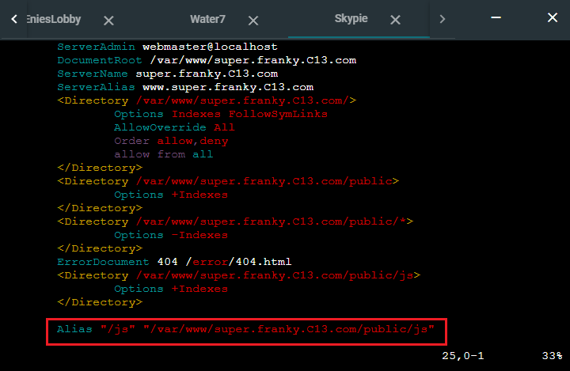
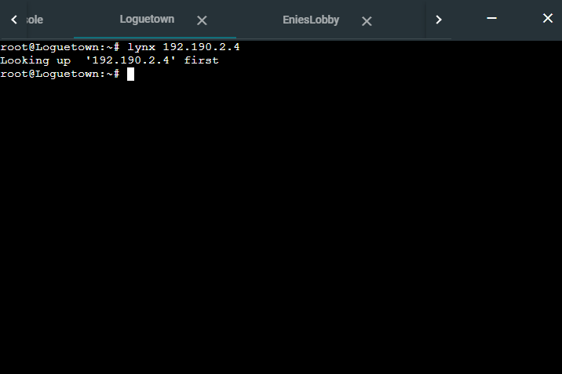

# Jarkom-Modul-2-C13-2021

## Anggota Kelompok :

| Anggota              | NRP            |
| -------------------- | -------------- |
| M. Auliya Mirzaq R.  | 05111940000065 |
| M. Akmal Joedhiawan  | 05111940000125 |
| M. Arsyad Ardiansyah | 05111940000228 |

## Soal

Luffy adalah seorang yang akan jadi Raja Bajak Laut. Demi membuat Luffy menjadi Raja Bajak Laut, Nami ingin membuat sebuah peta, bantu Nami untuk membuat peta berikut:


EniesLobby akan dijadikan sebagai DNS Master, Water7 akan dijadikan DNS Slave, dan Skypie akan digunakan sebagai Web Server. Terdapat 2 Client yaitu Loguetown, dan Alabasta. Semua node terhubung pada router Foosha, sehingga dapat mengakses internet (1).

Luffy ingin menghubungi Franky yang berada di EniesLobby dengan denden mushi. Kalian diminta Luffy untuk membuat website utama dengan mengakses franky.yyy.com dengan alias www.franky.yyy.com pada folder kaizoku (2). Setelah itu buat subdomain super.franky.yyy.com dengan alias www.super.franky.yyy.com yang diatur DNS nya di EniesLobby dan mengarah ke Skypie(3). Buat juga reverse domain untuk domain utama (4). Supaya tetap bisa menghubungi Franky jika server EniesLobby rusak, maka buat Water7 sebagai DNS Slave untuk domain utama (5). Setelah itu terdapat subdomain mecha.franky.yyy.com dengan alias www.mecha.franky.yyy.com yang didelegasikan dari EniesLobby ke Water7 dengan IP menuju ke Skypie dalam folder sunnygo(6). Untuk memperlancar komunikasi Luffy dan rekannya, dibuatkan subdomain melalui Franky dengan nama general.mecha.frank.yyy.com dengan alias www.general.mecha.franky.yyy.com yang mengarah ke Skypie(7).

(8) Setelah melakukan konfigurasi server, maka dilakukan konfigurasi Webserver. Pertama dengan webserver www.franky.yyy.com. Pertama, luffy membutuhkan webserver dengan DocumentRoot pada /var/www/franky.yyy.com. (9) Setelah itu, Luffy juga membutuhkan agar url www.franky.yyy.com/index.php/home dapat menjadi menjadi www.franky.yyy.com/home.

(10) Setelah itu, pada subdomain www.super.franky.yyy.com, Luffy membutuhkan penyimpanan aset yang memiliki DocumentRoot pada /var/www/super.franky.yyy.com .(11) Akan tetapi, pada folder /public, Luffy ingin hanya dapat melakukan directory listing saja.(12) Tidak hanya itu, Luffy juga menyiapkan error file 404.html pada folder /errors untuk mengganti error kode pada apache . (13) Luffy juga meminta Nami untuk dibuatkan konfigurasi virtual host. Virtual host ini bertujuan untuk dapat mengakses file asset www.super.franky.yyy.com/public/js menjadi www.super.franky.yyy.com/js.

(14) Dan Luffy meminta untuk web www.general.mecha.franky.yyy.com hanya bisa diakses dengan port 15000 dan port 15500 (15) dengan authentikasi username luffy dan password onepiece dan file di /var/www/general.mecha.franky.yyy (16) Dan setiap kali mengakses IP EniesLobby akan diahlikan secara otomatis ke www.franky.yyy.com (17). Dikarenakan Franky juga ingin mengajak temannya untuk dapat menghubunginya melalui website www.super.franky.yyy.com, dan dikarenakan pengunjung web server pasti akan bingung dengan randomnya images yang ada, maka Franky juga meminta untuk mengganti request gambar yang memiliki substring “franky” akan diarahkan menuju franky.png. Maka bantulah Luffy untuk membuat konfigurasi dns dan web server ini!

## Soal 1

EniesLobby akan dijadikan sebagai DNS Master, Water7 akan dijadikan DNS Slave, dan Skypie akan digunakan sebagai Web Server. Terdapat 2 Client yaitu Loguetown, dan Alabasta. Semua node terhubung pada router Foosha, sehingga dapat mengakses internet.

Setting network configuration pada semua node sesuai dengan Prefix IP dari kelompok C13 yaitu `192.190`

#### Foosha

```
auto eth0
iface eth0 inet dhcp

auto eth1
iface eth1 inet static
	address 192.190.1.1
	netmask 255.255.255.0

auto eth2
iface eth2 inet static
	address 192.190.2.1
	netmask 255.255.255.0

```

#### EniesLobby (DNS Master)

```
auto eth0
iface eth0 inet static
	address 192.190.2.2
	netmask 255.255.255.0
	gateway 192.190.1.1
```

#### Water7 (DNS Slave)

```
auto eth0
iface eth0 inet static
	address 192.190.2.3
	netmask 255.255.255.0
	gateway 192.190.1.1
```

#### Skypie (Web Server)

```
auto eth0
iface eth0 inet static
	address 192.190.2.4
	netmask 255.255.255.0
	gateway 192.190.1.1
```

#### Loguetown (Client)

```
auto eth0
iface eth0 inet static
	address 192.190.1.2
	netmask 255.255.255.0
	gateway 192.190.1.1
```

#### Alabasta (Client)

```
auto eth0
iface eth0 inet static
	address 192.190.1.3
	netmask 255.255.255.0
	gateway 192.190.1.1
```

jalankan perintah `iptables -t nat -A POSTROUTING -o eth0 -j MASQUERADE -s [Prefix IP].0.0/16` pada router `Foosha`

Keterangan:

- `iptables`: iptables merupakan suatu tools dalam sistem operasi Linux yang berfungsi sebagai filter terhadap lalu lintas data. Dengan iptables inilah kita akan mengatur semua lalu lintas dalam komputer, baik yang masuk, keluar, maupun yang sekadar melewati komputer kita. Untuk penjelasan lebih lanjut nanti akan dibahas pada Modul 5.

- `NAT` (Network Address Translation): Suatu metode penafsiran alamat jaringan yang digunakan untuk menghubungkan lebih dari satu komputer ke jaringan internet dengan menggunakan satu alamat IP.

- `Masquerade`: Digunakan untuk menyamarkan paket, misal mengganti alamat pengirim dengan alamat router.
  -s (Source Address): Spesifikasi pada source. Address bisa berupa nama jaringan, nama host, atau alamat IP.

Ketikkan command `cat /etc/resolv.conf` di Foosha


kemudian jalankan perintah berikut di node ubuntu yang lain `echo nameserver [IP DNS] > /etc/resolv.conf`. Jika pada kasus ini maka command-nya adalah `echo nameserver 192.168.122.1 > /etc/resolv.conf`, sesuaikan dengan IP DNS yang telah di cek ada node `Foosha`.

Setelah menjalankan perintah sebelumnya, cek apakah node sudah terhubung dengan internet dengan `ping google.com`


Jika berhasil maka node sudah terhubung dengan internet.

## Soal 2

Luffy ingin menghubungi Franky yang berada di EniesLobby dengan denden mushi. Kalian diminta Luffy untuk membuat website utama dengan mengakses franky.yyy.com dengan alias www.franky.yyy.com pada folder kaizoku.

#### Node EniesLobby

- Lakukan update dengan `apt-get update`

- Install bind9 dengan perintah `apt-get install bind9 -y`

- Edit file dengan perintah `vim /etc/bind/named.conf.local` lalu tambahkan kode berikut.

  ```
  zone "franky.C13.com" {
    type master;
    file "/etc/bind/kaizoku/franky.C13.com";
  };
  ```

  

- Membuat direktori baru sesuai dengan soal dengan cara `mkdir /etc/bind/kaizoku`

- Copy file `db.local` ke direktori yang baru dibuat dan ubah namanya sesuai domain yang diinginkan `cp /etc/bind/db.local /etc/bind/kaizoku/franky.C13.com`.

- Edit file `franky.C13.com` dengan perintah `vim /etc/bind/kaizoku/franky.C13.com` menjadi seperti berikut

  

- Lalu aktifkan perubahan yang dilakukan dengan restart bind9 dengan perintah :
  ```
  service bind9 restart
  ```

#### Node Loguetown/Alabasta

- Ubah settingan nameserver pada file `/etc/resolv.conf` sesuai gambar dibawah dengan IP Enieslobby
  ```
  nameserver 192.190.2.2
  ```
- Cek domain `franky.C13.com` dengan perintah `ping franky.C13.com`.

  

## Soal 3

Setelah itu buat subdomain super.franky.yyy.com dengan alias www.super.franky.yyy.com yang diatur DNS nya di EniesLobby dan mengarah ke Skypie.

#### Node EniesLobby

- Ketik `vim /etc/bind/kaizoku/franky.C13.com` untuk mengedit file `/etc/bind/kaizoku/franky.C13.com`, lalu tambahkan beris berikut

  ```
  super       IN      A       192.190.2.4
  www.super   IN      CNAME   super
  ```

  

- Restart service bind9 dengan perintah `service bind9 restart`

#### Node Loguetown/Alabasta

- Cek apakah subdomain `super.franky.C13.com` beserta alias `www.super.franky.C13.com` bisa diakses dengan `ping www.super.franky.C13.com`

  

## Soal 4

Buat juga reverse domain untuk domain utama.

#### Node EniesLobby

- Edit file `named.conf.local` dengan perintah `vim /etc/bind/named.conf.local` lalu ubah konfigurasi seperti gambar dibawah ini.

  ```
    zone "2.190.192.in-addr.arpa" {
      type master;
      file "/etc/bind/kaizoku/2.190.192.in-addr.arpa";
    };
  ```

  

- Copy file `db.local` ke dalam folder kaizoku yang telah dibuat dan ubah namanya menjadi `2.190.192.in-addr.arpa` dengan cara mengetikkan perintah `cp /etc/bind/db.local /etc/bind/kaizoku/2.190.192.in-addr.arpa`. `2.190.192` merupakan 3 byte pertama yang dibalik dari IP Address Enieslobby.

- Kemudian edit file `2.190.192.in-addr.arpa` dan ubah konfigurasinya menjadi seperti gambar dibawah.

  

- Restart service bind9 dengan perintah `service bind9 restart`

#### Node Loguetown/Alabasta

- Melakukan update dengan perintah `apt-get update`, sebelumnya mengubah nameserver ke default terlebih dahulu agar update dapat dijalanakan kemudian mengembalikan ke IP EniesLobby.

- Install `dnsutils` dengan perintah `apt-get install dnsutils`

- Mencoba reverse dns dengan perintah `host -t PTR 192.190.2.2`

  

## Soal 5

Supaya tetap bisa menghubungi Franky jika server EniesLobby rusak, maka buat Water7 sebagai DNS Slave untuk domain utama.

#### Node EniesLobby

- Edit file `named.conf.local` dengan perintah `vim /etc/bind/named.conf.local` lalu ubah konfigurasi seperti gambar dibawah ini.

  ```
    zone "franky.C13.com" {
      type master;
      notify yes;
      also-notify { 192.190.2.3; }; // Masukan IP Water7 tanpa tanda petik
      allow-transfer { 192.190.2.3; }; // Masukan IP Water7 tanpa tanda petik
      file "/etc/bind/kaizoku/franky.C13.com";
    };

    zone "2.190.192.in-addr.arpa" {
        type master;
        file "/etc/bind/kaizoku/2.190.192.in-addr.arpa";
    };
  ```

  

- Restart service bind9 dengan perintah `service bind9 restart`

#### Node Water7

- Melakukan update `apt-get update` dan install bind9 `apt-get install bind9 -y`

- Edit file `named.conf.local` dengan perintah `vim /etc/bind/named.conf.local` lalu ubah konfigurasi seperti gambar dibawah ini.

  ```
    zone "franky.C13.com" {
      type slave;
      masters { 192.190.2.2; }; // Masukan IP EniesLobby tanpa tanda petik
      file "/var/lib/bind/franky.C13.com";
    };
  ```

  

- Restart service bind9 dengan perintah `service bind9 restart`

- Untuk cek apakah konfigurasi berhasil, maka bind9 pada node EniesLobby harus di stop dengan perintah `service bind9 stop`

  

#### Node Loguetown/Alabasta

- Ubah nameserver pada file `/etc/bind/resolv.conf` yang mengarah ke IP Water7 dengan menambahkan `nameserver 192.190.2.3`

- Cek apakah DNS Slave berhasil dengan `ping franky.C13.com`

  

## Soal 6

Setelah itu terdapat subdomain mecha.franky.yyy.com dengan alias www.mecha.franky.yyy.com yang didelegasikan dari EniesLobby ke Water7 dengan IP menuju ke Skypie dalam folder sunnygo.

#### Node EniesLobby

- Edit file `/etc/bind/kaizoku/franky.C13.com` dengan perintah `vim /etc/bind/kaizoku/franky.C13.com` lalu ubah konfigurasi seperti gambar dibawah ini.
  
- Edit file `named.conf.options` dengan perintah `vim /etc/bind/named.conf.options`.
- Comment pada baris `dnssec-validation auto;` dan menambahkan baris berikut `allow-query{any;};` dibawahnya.
  
- Edit file `named.conf.local` dengan perintah `vim /etc/bind/named.conf.local` lalu ubah konfigurasi seperti gambar dibawah ini.
  
- Restart bind9.

#### Node Water7

- Edit file `named.conf.options` dengan perintah `vim /etc/bind/named.conf.options`.
- Comment pada baris `dnssec-validation auto;` dan menambahkan baris berikut `allow-query{any;};` dibawahnya.

  

- Edit file `named.conf.local` dengan perintah `/etc/bind/named.conf.local` lalu ubah konfigurasi seperti gambar dibawah ini.
  
- Membuat direktori baru dengan nama sesuai yang akan didelegasikan, lalu copy `db.local` ke direktori yang baru dibuat dan mengubah namanya menjadi `mecha.franky.C13.com` dengan perintah `mkdir sunnygo` dan `cp /etc/bind/db.local /etc/bind/sunnygo/mecha.franky.C13.com`.
- Edit file `mecha.franky.C13.com` lalu ubah konfigurasi seperti gambar dibawah ini.
  
- Restart bind9.

#### Node Loguetown/Alabasta

- cek apakah konfigurasi berhasil dengan `ping mecha.franky.C13.com`
  

## Soal 7

Untuk memperlancar komunikasi Luffy dan rekannya, dibuatkan subdomain melalui Franky dengan nama general.mecha.frank.yyy.com dengan alias www.general.mecha.franky.yyy.com yang mengarah ke Skypie.

#### Node Water7

- Edit file `/etc/bind/sunnygo/mecha.franky.C13.com` dengan perintah `vim /etc/bind/sunnygo/mecha.franky.C13.com` lalu ubah konfigurasi seperti gambar dibawah ini.
  
- Restart bind9.

#### Node Loguetown/Alabasta

- Cek apakah konfigurasi berhasil dengan `ping general.mecha.franky.C13.com`
  

## Soal 8

Setelah melakukan konfigurasi server, maka dilakukan konfigurasi Webserver. Pertama dengan webserver www.franky.yyy.com. Pertama, luffy membutuhkan webserver dengan DocumentRoot pada /var/www/franky.yyy.com.

#### Node Skypie

- Install Apache2 dan PHP dengan perintah `apt-get install apache2` dan `apt-get install php`
- Pindah ke direktori `/etc/apache2/sites-available` untuk membuat web server baru dengan nama `franky.C13.com`.
- Edit file default pada direktori `/etc/apache2/sites-available` dengan mengubah `DocumentRoot` dan menambahkan `ServerAlias` dan `ServerName`.

  

- Pindah direktori ke `/var/www/` lalu download file yang akan ditampilkan dengan cara `wget https://github.com/FeinardSlim/Praktikum-Modul-2-Jarkom/raw/main/franky.zip`, sebelumnya install dahulu `apt-get install wget`.
- Unzip file yang telah didownload dengan perintah `unzip franky.zip`, sebelumnya install dahulu `apt-get install unzip`.
- Setelah itu file yang telah di unzip dipindahkan ke direktori yang telah ditetapkan yaitu `/var/www/franky.C13.com/`.
  
- Mengaktifkan konfigurasi website dengan perintah `a2ensite franky.C13.com`.
- Restart Apache2

#### Node Loguetown/Alabasta

- Install lynx untuk menampilkan isi dari file yang telah didownload dengan cara `apt-get install lynx`
- Ketik `lynx www.franky.C13.com` untuk mengakses web tersebut.
  

## Soal 9

Setelah itu, Luffy juga membutuhkan agar url www.franky.yyy.com/index.php/home dapat menjadi menjadi www.franky.yyy.com/home.

#### Node Skypie

- Edit file `default` pada direktori `franky.C13.com` lalu tambahkan `Alias` seperti gambar dibawah.  
  
- Mengaktifkan konfigurasi website dengan perintah `a2ensite franky.C13.com`.
- Restart Apache2.

#### Node Loguetown/Alabasta

- Ketik `lynx www.franky.C13.com/home` untuk mengakses web tersebut.
  

## Soal 10

Setelah itu, pada subdomain www.super.franky.yyy.com, Luffy membutuhkan penyimpanan aset yang memiliki DocumentRoot pada /var/www/super.franky.yyy.com.

#### Node Skypie

- Copy file default menjadi file baru dengan nama sesuai domain pada soal `super.franky.C13.com` di direktori `/etc/apache2/sites-available`
- Edit file `super.franky.C13.com` pada direktori `/etc/apache2/sites-available` dengan mengubah `DocumentRoot` dan menambahkan `ServerAlias` dan `ServerName`.
  
- Pindah direktori ke `/var/www/` lalu download file yang akan ditampilkan dengan cara `wget https://github.com/FeinardSlim/Praktikum-Modul-2-Jarkom/raw/main/super.franky.zip`.
- Unzip file yang telah didownload dengan perintah `unzip super.franky.zip`.
- Setelah itu file yang telah di unzip dipindahkan ke direktori yang telah ditetapkan yaitu `/var/www/super.franky.C13.com/`.
  
- Mengaktifkan konfigurasi website dengan perintah `a2ensite super.franky.C13.com`.
- Restart Apache2

#### Node Loguetown/Alabasta

- Ketik `lynx www.super.franky.C13.com` untuk mengakses web tersebut.
  

## Soal 11

Akan tetapi, pada folder /public, Luffy ingin hanya dapat melakukan directory listing saja.

#### Node Skypie

- Edit file `super.franky.C13.com` pada direktori `/etc/apache2/sites-available` dengan menambahkan sesuai gambar dibawah.
  
- Mengaktifkan konfigurasi website dengan perintah `a2ensite super.franky.C13.com`.
- Restart Apache2.

#### Node Loguetown/Alabasta

- Cek apakah directory listing berhasil dengan cara akses link `www.super.franky.C13.com/public`.
- super.franky.C13.com/public/css
  
- super.franky.C13.com/public/images
  
- super.franky.C13.com/public/js
  

## Soal 12

Tidak hanya itu, Luffy juga menyiapkan error file 404.html pada folder /errors untuk mengganti error kode pada apache.

#### Node Skypie

- Edit file `super.franky.C13.com` pada direktori `/etc/apache2/sites-available` dengan menambahkan `ErrorDocument` sesuai gambar dibawah.

  

- Lalu aktifkan perubahan yang dilakukan dengan restart Apache 2 dengan perintah :
  ```
  service apache2 restart
  ```

## Soal 13

Luffy juga meminta Nami untuk dibuatkan konfigurasi virtual host. Virtual host ini bertujuan untuk dapat mengakses file asset www.super.franky.yyy.com/public/js menjadi www.super.franky.yyy.com/js.

#### Node Skypie

- Edit file `super.franky.C13.com` pada direktori `/etc/apache2/sites-available` dengan menambahkan sebuah alias berikut `Alias "/js" "/var/www/super.franky.C13.com/public/js"`

  

- Lalu aktifkan perubahan yang dilakukan dengan restart Apache 2 dengan perintah :
  ```
  service apache2 restart
  ```

#### Node Loguetown/Alabasta

- Ketika mengakses alamat `www.super.franky.yyy.com/js` akan diarahkan ke alamat `www.super.franky.yyy.com/public/js`

  

## Soal 14

Dan Luffy meminta untuk web www.general.mecha.franky.yyy.com hanya bisa diakses dengan port 15000 dan port 15500.

#### Node Skypie

- Copy file default `000-default.conf` menjadi file baru dengan nama sesuai domain pada soal `general.mecha.franky.C13.com.conf` di direktori `/etc/apache2/sites-available`.

- Edit file `general.mecha.franky.C13.com` pada direktori `/etc/apache2/sites-available` dengan mengubah `VirtualHost` dan `DocumentRoot` serta menambahkan `ServerAlias` dan `ServerName` menjadi seperti ini

  ```
  <VirtualHost *:15000>

        ServerAdmin webmaster@localhost
        DocumentRoot /var/www/general.mecha.franky.C13.com
        ServerName general.mecha.franky.C13.com
        ServerAlias www.general.mecha.franky.C13.com

        <Directory /var/www/general.mecha.franky.C13.com>
                AuthType Basic
                AuthName "Private!"
                AuthUserFile "/var/www/general.mecha.franky.C13.com/.htpasswd"
                require valid-user
        </Directory>

        ErrorLog ${APACHE_LOG_DIR}/error.log
        CustomLog ${APACHE_LOG_DIR}/access.log combined

  </VirtualHost>
  <VirtualHost *:15500>

        ServerAdmin webmaster@localhost
        DocumentRoot /var/www/general.mecha.franky.C13.com
        ServerName general.mecha.franky.C13.com
        ServerAlias www.general.mecha.franky.C13.com

        <Directory /var/www/general.mecha.franky.C13.com>
                AuthType Basic
                AuthName "Private!"
                AuthUserFile "/var/www/general.mecha.franky.C13.com/.htpasswd"
                require valid-user
        </Directory>

        ErrorLog ${APACHE_LOG_DIR}/error.log
        CustomLog ${APACHE_LOG_DIR}/access.log combined

  </VirtualHost>
  ```

  

- Kemudian aktifkan poert 15000 dan 15500 dengan menambahkan listen port pada file `/etc/apache2/ports.conf`

  

- Pindah direktori ke `/var/www/` lalu download file yang akan ditampilkan dengan cara `wget https://github.com/FeinardSlim/Praktikum-Modul-2-Jarkom/raw/main/general.mecha.franky.zip`.

- Unzip file yang telah didownload dengan perintah `unzip general.mecha.franky.zip`.

- Setelah itu rename folder yang telah di unzip sesuai dengan direktori yang telah ditetapkan yaitu `/var/www/general.mecha.franky.C13.com/`.

- Mengaktifkan konfigurasi website dengan perintah `a2ensite general.mecha.franky.C13.com`.

- Lalu aktifkan perubahan yang dilakukan dengan restart Apache 2 dengan perintah :
  ```
  service apache2 restart
  ```

#### Node Loguetown/Alabasta

- Cek konfigurasi apakah telah berhasil dengan cara `lynx general.mecha.franky.C13.com.pw:15000` dan `lynx general.mecha.franky.C13.com.pw:15500`

  

## Soal 15

Dengan authentikasi username luffy dan password onepiece dan file di /var/www/general.mecha.franky.yyy.

#### Node Skypie

- Edit file `general.mecha.franky.C13.com` pada direktori `/etc/apache2/sites-available` dan tambahkan baris berikut pada kedua `VirtualHost`

  ```
  <Directory /var/www/general.mecha.franky.C13.com>
    AuthType Basic
    AuthName "Private!"
    AuthUserFile "/var/www/general.mecha.franky.C13.com/.htpasswd"
    require valid-user
  </Directory>
  ```

  

- Kemudian buat file `htpasswd` untuk _authentication_ `/var/www/general.mecha.franky.C13.com/.htpasswd` dengan perintah berikut

  ```
  htpasswd -cb /var/www/general.mecha.franky.C13.com/.htpasswd luffy onepiece
  ```

- Lalu aktifkan perubahan yang dilakukan dengan restart Apache 2 dengan perintah :
  ```
  service apache2 restart
  ```

#### Node Skypie

- Lalu cek apakah basic authentication sudah berhasil dibuat dengan akses `general.mecha.franky.C13.com`
  
  
  

## Soal 16

Dan setiap kali mengakses IP EniesLobby akan diahlikan secara otomatis ke www.franky.yyy.com.

#### Node Skypie

- Edit file default `000-default.conf` pada direktori `/etc/apache2/sites-available` dengan mengarahkan `DocumentRoot` ke `/var/www/franky.C13.com` seperti gambar dibawah ini.

  

- Lalu aktifkan perubahan yang dilakukan dengan restart Apache 2 dengan perintah :
  ```
  service apache2 restart
  ```

#### Node Loguetown/Alabasta

- Ketika mengakses `192.190.2.4` akan diarahkan menuju website `franky.C13.com`
  
  

## Soal 17

Dikarenakan Franky juga ingin mengajak temannya untuk dapat menghubunginya melalui website www.super.franky.yyy.com, dan dikarenakan pengunjung web server pasti akan bingung dengan randomnya images yang ada, maka Franky juga meminta untuk mengganti request gambar yang memiliki substring “franky” akan diarahkan menuju franky.png. Maka bantulah Luffy untuk membuat konfigurasi dns dan web server ini!

#### Node Skypie

- Buat file `.htaccess` ke dalam direktori `/var/www/super.franky.C13.com` lalu tambahkan seperti gambar dibawah ini.

  

- Kemudian kita perlu menambahkan command pada `/etc/apache2/sites-available/super.franky.C13.com` agar `.htaccess` yang telah dibuat dapat berjalan dengan menambahkan baris berikut

  ```
  <Directory /var/www/super.franky.C13.com/>
    Options Indexes FollowSymLinks
    AllowOverride All
    Order allow,deny
    allow from all
  </Directory>
  ```

  

- Kemudian aktifkan modul rewrite agar perubahan sebelumnya dapat bekerja

  ```
  a2enmod rewrite
  ```

- Lalu aktifkan perubahan yang dilakukan dengan restart Apache 2 dengan perintah :
  ```
  service apache2 restart
  ```

#### Node Loguetown/Alabasta

Karena pada terminal tidak dapat melihat sebuah gambar, maka untuk membuktikan apakah saat membuka gambar yang memiliki substring `franky` akan diarahkan ke gambar `franky.png`. Kita dapat mengeceknya dengan menggunakan ukuran gambar.

- Pertama kita akan mengecek ukuran gambar `franky.png` sebagai pembanding nantinya. Dapat dilihat bahwa gambar tersebut memiliki ukuran 656785 bytes
  

- Ketika mengakses `super.franky.C13.com/public/images/not-franky.jpg` akan diarahkan menuju website `super.franky.C13.com/public/images/franky.png` karena memiliki substring franky didalamnya. Kita akan download untuk mengecek ukurannya

  

- Jika benar maka gambar yang didownload yaitu `not-franky.png` akan memiliki ukuran yang sama dengan gambar `franky.png` yaitu 656785 bytes. Untuk ukuran gambar `not-franky.png` sebenarnya adalah 22839 bytes

  

- Ketika mengakses `super.franky.C13.com/public/images/car.jpg` akan tetap menuju website `super.franky.C13.com/public/images/car.jpg` karena tidak memiliki kata franky didalamnya. Kita akan download juga untuk cek ukuran gambar tersebut

  

- Dapat dilihat untuk ukuran gambar `car.jpg` tetap memiliki ukuran aslinya yaitu 89595 bytes.

  
